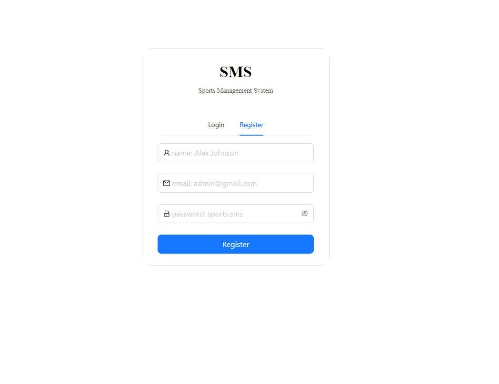
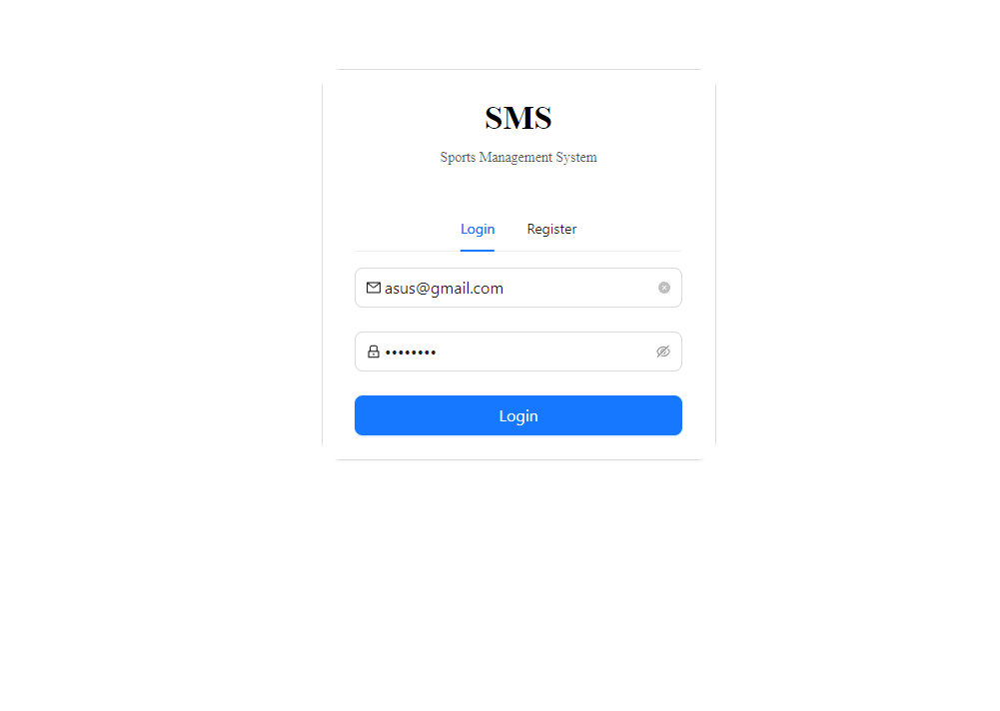
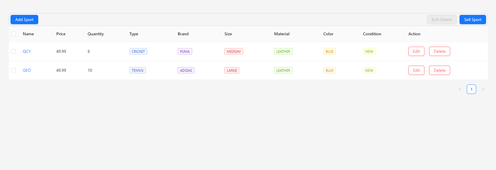
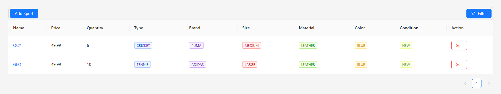
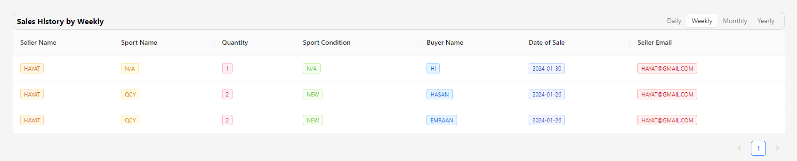
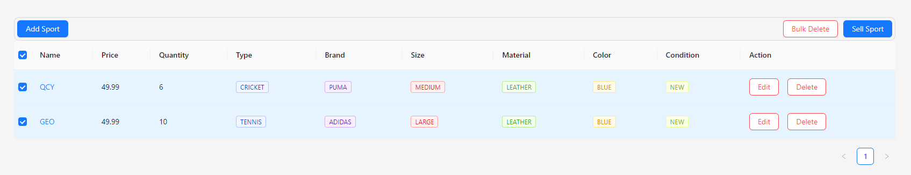

## Sports Items Management Dashboard

**Objective:** The primary objective of this assignment is to design and implement a comprehensive Sports Items Management Dashboard, providing the tools to efficiently manage the sports inventory, track sales, and analyze sales history. The assignment will incorporate features such as authentication, CRUD operations, state management, real-time UI updates, and sports items filtering.

## Client Site

[view browser](https://sports-item-management-client.vercel.app/)

## Server Site

[view browser](https://sports-item-management.vercel.app/api/v1)

## API Reference

[view postman](https://documenter.getpostman.com/view/27606520/2s9YyqkPCi)

**Authentication:**

1. **User Registration and Login:**
   - Users must register and log in to access the dashboard.

**Functionality:**

1. Sports Items **Management:**
   - CRUD Operations:
     - Add a new sports item to the inventory.
     - Delete existing sports items from the inventory.
     - Update sports item details.
     - Read and view the list of sports items in the inventory.

2. **Sales Management:**

   - Users can search for a product to sell, and upon finding it, they can click the "Sell" button. On clicking the sell button a form will pop up. The form will have the following fields: - Quantity of the product to be sold (Input quantity cannot exceed the current available stock of the product) - Name of the buyer - Date of the sale
     

3. **Sales History:**
   - View sales history categorized by:
     - Weekly
     - Daily
     - Monthly
     - Yearly

